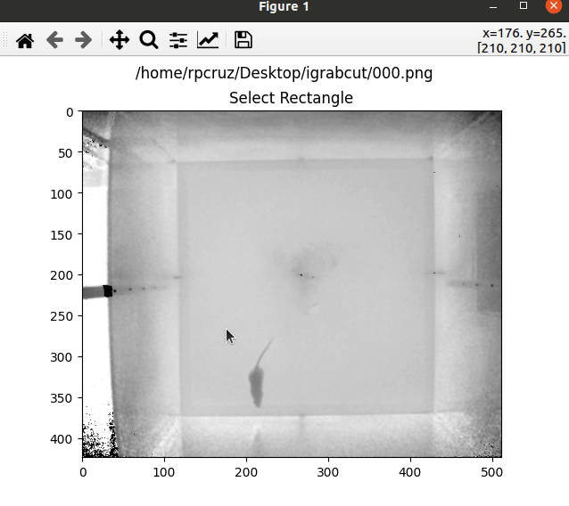

# iGrabCut
Interactive image segmentation tool using [GrabCut](https://docs.opencv.org/master/d8/d83/tutorial_py_grabcut.html).

The code is less than 100 lines. It is a little tool that combines the GrabCut algorithm with a simple interface for manual segmentation. It asks for which file(s) to segment (multiple files may be provided for batch segmentation), then you select the bounding box of the object to segment, and finally use mouse strokes (left-click=foreground, right-click=background) to guide the GrabCut algorithm. Just close the window or press enter/escape to go to the next image. The segmentations are saved in the same folder as the original images with the `-seg.png` suffix.

Credits:
* The GrabCut algorithm comes from OpenCV
* The Matplotlib line selector comes from [Steven Silvester](https://gist.github.com/blink1073)
